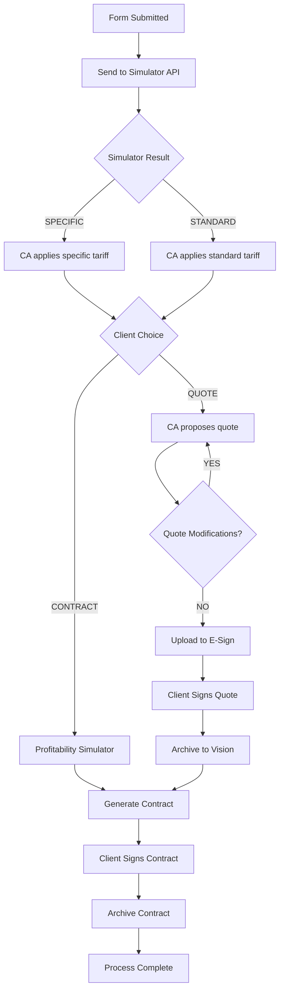

# Workflow Orchestrator - Camunda Form Submission Process

[](https://github.com/company/workflow-orchestrator)
[](https://openjdk.java.net/projects/jdk/17/)
[](https://spring.io/projects/spring-boot)
[](https://camunda.com/)

A comprehensive workflow orchestrator built with Spring Boot and Camunda BPM that manages complex form submission processes with external integrations for simulator APIs, E-Sign platforms, and document archiving systems.

## 🚀 Quick Start

### Prerequisites

- **Java 17** or higher
- **Maven 3.8+**
- **Docker & Docker Compose** (for PostgreSQL)
- **Git**

### Installation

1. **Clone the repository**
```bash
git clone https://github.com/company/workflow-orchestrator.git
cd workflow-orchestrator
```

2. **Start PostgreSQL with Docker Compose**
```bash
docker-compose up -d postgres pgadmin
```

3. **Build and run the application**
```bash
./mvnw clean spring-boot:run
```

4. **Access the application**
- **Application**: http://localhost:8080
- **Camunda Cockpit**: http://localhost:8080/camunda/app/cockpit/default/
- **Camunda Tasklist**: http://localhost:8080/camunda/app/tasklist/default/
- **pgAdmin**: http://localhost:5050 (admin@admin.com / admin)

## 📋 Table of Contents

- [Architecture Overview](#architecture-overview)
- [Workflow Process](#workflow-process)
- [API Documentation](#api-documentation)
- [Configuration](#configuration)
- [External Integrations](#external-integrations)
- [Development](#development)
- [Testing](#testing)
- [Deployment](#deployment)
- [Monitoring](#monitoring)

## 🏗️ Architecture Overview

This application follows a **hexagonal architecture** pattern with clear separation of concerns:

```
src/
├── main/
│   ├── java/com/company/orchestrator/
│   │   ├── application/           # Application services & use cases
│   │   ├── domain/               # Domain models & business logic
│   │   ├── infrastructure/       # External integrations & delegates
│   │   │   └── delegate/         # Camunda service task delegates
│   │   └── interfaces/           # REST controllers & adapters
│   └── resources/
│       ├── onboarding-process.bpmn    # Main BPMN workflow
│       └── application.yml            # Configuration
└── test/                        # Unit & integration tests
```

### Key Components

- **Workflow Engine**: Camunda BPM 7.20.0
- **Database**: PostgreSQL 15
- **Framework**: Spring Boot 3.2.0
- **Build Tool**: Maven with wrapper
- **Architecture**: Hexagonal/Clean Architecture

## 🔄 Workflow Process

The **Form Submission Process** (`onboarding-process`) handles complex business scenarios with multiple decision points and external system integrations.

### Process Flow



### Key Decision Points

1. **Simulator API Integration**: Determines tariff type (SPECIFIC/STANDARD)
2. **Client Path Selection**: Quote-first vs. direct contract
3. **Quote Modification Loop**: Iterative quote refinement
4. **Document Flow**: E-Sign → Vision archiving pattern

## 📡 API Documentation

### REST Endpoints

#### Start Workflow Process

**POST** `/api/workflow/start`

Initiates a new form submission workflow process.

**Request Body:**
```json
{
  "customerId": "CUST_12345",
  "customerName": "John Doe",
  "customerEmail": "john.doe@email.com",
  "customerAddress": "123 Main St, City, Country",
  "requestedProduct": "BUSINESS_LOAN",
  "requestedAmount": 50000.00,
  "riskProfile": "MEDIUM",
  "businessUnit": "COMMERCIAL",
  "salesRepresentative": "jane.smith@company.com",
  "formSubmissionId": "FORM_20241001_001",
  "submissionTimestamp": "2024-10-01T10:30:00Z"
}
```

**Response:**
```json
{
  "processInstanceId": "e7d8c9b6-4f3e-4a2b-8c1d-9e8f7a6b5c4d",
  "status": "STARTED",
  "message": "Form submission process started successfully",
  "timestamp": "2024-10-01T10:30:15Z"
}
```

#### Get Process Status

**GET** `/api/workflow/status/{processInstanceId}`

**Response:**
```json
{
  "processInstanceId": "e7d8c9b6-4f3e-4a2b-8c1d-9e8f7a6b5c4d",
  "status": "ACTIVE",
  "currentActivity": "apply-specific-tariff",
  "variables": {
    "customerId": "CUST_12345",
    "simulatorResult": "SPECIFIC",
    "profitabilityStatus": "ACCEPTABLE"
  },
  "activeUserTasks": [
    {
      "taskId": "task_123",
      "taskName": "CA applies specific tariff conditions",
      "assignee": "ca-agent",
      "created": "2024-10-01T10:30:20Z"
    }
  ]
}
```

### Process Variables Reference

| Variable | Type | Description | Set By |
|----------|------|-------------|---------|
| `customerId` | String | Unique customer identifier | Start event |
| `simulatorResult` | String | SPECIFIC/STANDARD tariff type | SimulatorApiDelegate |
| `profitabilityStatus` | String | ACCEPTABLE/MARGINAL/UNACCEPTABLE | ProfitabilitySimulatorDelegate |
| `clientChoice` | String | CONTRACT/QUOTE customer decision | User task |
| `eSignDocumentId` | String | E-Sign platform document ID | ESignUploadDelegate |
| `contractId` | String | Generated contract identifier | ContractGenerationDelegate |
| `visionArchiveReference` | String | Archive reference in Vision | VisionArchiveDelegate |

📚 **Complete API Documentation**: [API_DOCUMENTATION.md](API_DOCUMENTATION.md)  
🚀 **Quick Integration Guide**: [INTEGRATION_GUIDE.md](INTEGRATION_GUIDE.md)

## ⚙️ Configuration

### Application Properties

```yaml
# Database Configuration
spring:
  datasource:
    url: jdbc:postgresql://localhost:5432/workflow_db
    username: workflow_user
    password: workflow_pass
    driver-class-name: org.postgresql.Driver
  
  jpa:
    hibernate:
      ddl-auto: update
    show-sql: false
    properties:
      hibernate:
        dialect: org.hibernate.dialect.PostgreSQLDialect

# Camunda Configuration
camunda:
  bpm:
    webapp:
      index-redirect-enabled: false
    admin-user:
      id: admin
      password: admin
      firstName: Administrator
    filter:
      create: All tasks

# External APIs Configuration
external:
  simulator:
    api:
      url: http://localhost:8081/api/simulator
      timeout: 5000
  
  profitability:
    api:
      url: http://localhost:8082/api/profitability
  
  esign:
    api:
      url: http://localhost:8083/api/esign
      key: ${ESIGN_API_KEY:default-api-key}
      webhook:
        url: http://localhost:8080/api/webhook/esign
  
  vision:
    api:
      url: http://localhost:8084/api/vision
      key: ${VISION_API_KEY:default-vision-key}
  
  contract:
    generator:
      url: http://localhost:8085/api/contract
      key: ${CONTRACT_API_KEY:default-contract-key}

# Business Configuration
profitability:
  threshold:
    minimum: 0.05
    target: 0.15

vision:
  retention:
    years: 7
```

### Environment Variables

| Variable | Description | Default |
|----------|-------------|---------|
| `ESIGN_API_KEY` | E-Sign platform API key | default-api-key |
| `VISION_API_KEY` | Vision archive system API key | default-vision-key |
| `CONTRACT_API_KEY` | Contract generator API key | default-contract-key |
| `DB_PASSWORD` | PostgreSQL password | workflow_pass |

## 🔌 External Integrations

### 1. Simulator API Integration

**Purpose**: Determines tariff conditions based on customer and product data.

**Endpoint**: `POST /api/simulator`

**Expected Response**:
```json
{
  "result": "SPECIFIC",
  "recommendation": "Special conditions required",
  "tariffType": "CUSTOM",
  "riskScore": 65
}
```

### 2. Profitability Simulator

**Purpose**: Analyzes contract profitability for direct-to-contract paths.

**Endpoint**: `POST /api/profitability`

### 3. E-Sign Platform

**Purpose**: Handles electronic document signing workflow.

**Endpoint**: `POST /api/esign/upload`

### 4. Vision Archive System

**Purpose**: Long-term document archiving for compliance.

**Features**: 7-year retention, metadata tagging, audit trail

### 5. Contract Generator

**Purpose**: Generates standardized or custom contracts.

**Outputs**: PDF contracts with embedded metadata

## 🛠️ Development

### Running in Development Mode

```bash
# Start dependencies
docker-compose up -d postgres

# Run with dev profile
./mvnw spring-boot:run -Dspring-boot.run.profiles=dev

# Hot reload with DevTools
./mvnw spring-boot:run -Dspring-boot.run.jvmArguments="-Dspring.devtools.restart.enabled=true"
```

### Building the Project

```bash
# Clean build
./mvnw clean compile

# Run tests
./mvnw test

# Package application
./mvnw clean package

# Skip tests during build
./mvnw clean package -DskipTests
```

### BPMN Development

1. **Install VS Code Extension**: BPMN.io Editor
2. **Open BPMN File**: `src/main/resources/onboarding-process.bpmn`
3. **Visual Editing**: Use the graphical editor for process modeling
4. **Validate**: Check for missing delegate expressions

## 🧪 Testing

### Unit Tests

```bash
# Run unit tests only
./mvnw test -Dtest="*Test"

# Run specific test class
./mvnw test -Dtest="WorkflowControllerTest"
```

### Integration Tests

```bash
# Run integration tests
./mvnw test -Dtest="*IT"

# Run with Testcontainers
./mvnw verify
```

### Manual Testing

1. **Start Process**: POST to `/api/workflow/start`
2. **Check Camunda Tasklist**: http://localhost:8080/camunda/app/tasklist/default/
3. **Complete User Tasks**: Use Tasklist UI or REST API
4. **Monitor Progress**: Check Cockpit for process instances

## 🚀 Deployment

### Docker Deployment

```bash
# Build Docker image
docker build -t workflow-orchestrator:latest .

# Run with Docker Compose
docker-compose up -d
```

### Production Configuration

```yaml
# application-prod.yml
spring:
  profiles:
    active: prod
  
logging:
  level:
    com.company.orchestrator: INFO
    org.camunda: WARN
  
management:
  endpoints:
    web:
      exposure:
        include: health,info,metrics
```

### Health Checks

The application exposes health endpoints:

- **Health**: `/actuator/health`
- **Info**: `/actuator/info`
- **Metrics**: `/actuator/metrics`

## 📊 Monitoring

### Camunda Monitoring

- **Cockpit**: Process instance monitoring, incident management
- **Admin**: User management, system configuration
- **Tasklist**: User task management interface

### Application Monitoring

- **Logs**: Structured logging with correlation IDs
- **Metrics**: Spring Boot Actuator endpoints
- **Health Checks**: Database and external API connectivity

### Key Metrics to Monitor

1. **Process Completion Rate**: % of successfully completed processes
2. **Average Process Duration**: Time from start to completion
3. **External API Response Times**: Integration performance
4. **Error Rates**: Failed service task executions
5. **User Task Completion Times**: Manual task performance

## 🤝 Contributing

### Development Workflow

1. **Fork** the repository
2. **Create** a feature branch: `git checkout -b feature/amazing-feature`
3. **Commit** changes: `git commit -m 'Add amazing feature'`
4. **Push** to branch: `git push origin feature/amazing-feature`
5. **Open** a Pull Request

### Code Standards

- **Java**: Follow Google Java Style Guide
- **BPMN**: Use meaningful task names and proper error handling
- **Git**: Conventional commit messages
- **Tests**: Maintain 80%+ code coverage

## 📄 License

This project is licensed under the MIT License - see the [LICENSE](LICENSE) file for details.

## 🔗 Useful Links

- [Camunda Documentation](https://docs.camunda.org/)
- [Spring Boot Reference](https://docs.spring.io/spring-boot/docs/current/reference/htmlsingle/)
- [BPMN 2.0 Specification](https://www.omg.org/spec/BPMN/2.0/)
- [PostgreSQL Documentation](https://www.postgresql.org/docs/)

## 📞 Support

For support and questions:

- **Email**: support@company.com
- **Documentation**: [Internal Wiki](https://wiki.company.com/workflow-orchestrator)
- **Issues**: [GitHub Issues](https://github.com/company/workflow-orchestrator/issues)

---

**Last Updated**: October 2024  
**Version**: 1.0.0  
**Maintainer**: Development Team

#### Étape 1: Démarrer PostgreSQL
```bash
docker-compose up -d
```

#### Étape 2: Compiler le projet
```bash
./mvnw clean compile
```

#### Étape 3: Lancer les tests
```bash
./mvnw test
```

#### Étape 4: Démarrer l'application
```bash
./mvnw spring-boot:run
```

## 📊 Interfaces disponibles

| Service | URL | Credentials |
|---------|-----|-------------|
| **Camunda Cockpit** | http://localhost:8080 | admin/admin |
| **pgAdmin** | http://localhost:5050 | admin@company.com/admin123 |
| **API REST** | http://localhost:8080/api/workflow | - |
| **H2 Console (tests)** | http://localhost:8080/h2-console | sa/ |

## 🔄 Processus BPMN d'Onboarding

Le workflow d'onboarding comprend les étapes suivantes :

1. **Start Event** - Démarrage du processus
2. **User Task** - Validation des documents client
3. **Gateway** - Vérification de la validité des documents
4. **Service Task** - Profitability analysis
5. **Gateway** - Tariff decision (SPECIFIC/STANDARD)
6. **Gateway** - Client choice (Quote/Contract)
7. **User Task** - Quote modification (if needed)
8. **Service Task** - E-Sign document upload
9. **Service Task** - Contract generation
10. **Service Task** - Vision archive
11. **End Event** - Process completion

### Process Variables
- `customerId` - Unique customer identifier
- `customerName` - Customer name
- `email` - Customer email
- `tariffCondition` - Simulator result (SPECIFIC/STANDARD)
- `clientChoice` - Customer choice (QUOTE/CONTRACT)
- `premium` - Insurance premium amount
- `riskLevel` - Niveau de risque (LOW/MEDIUM/HIGH)
- `accountId` - Identifiant du compte créé

## 📡 API REST

### Démarrer un processus d'onboarding
```http
POST /api/workflow/onboarding/start
Content-Type: application/json

{
  "customerName": "John Doe",
  "email": "john.doe@example.com",
  "age": 30,
  "profession": "Software Engineer",
  "monthlyIncome": 5000.0,
  "country": "France"
}
```

**Réponse:**
```json
{
  "processInstanceId": "12345",
  "processDefinitionId": "onboarding-process:1:abc123",
  "customerId": "uuid-generated",
  "status": "STARTED",
  "message": "Onboarding process started successfully"
}
```

### Vérifier le statut d'un processus
```http
GET /api/workflow/process/{processInstanceId}/status
```

**Réponse:**
```json
{
  "processInstanceId": "12345",
  "status": "RUNNING",
  "activityId": "validate-documents",
  "variables": {
    "customerId": "uuid-generated",
    "customerName": "John Doe",
    "email": "john.doe@example.com"
  }
}
```

## 🧪 Tests

### Tests unitaires
```bash
./mvnw test -Dtest=*Test
```

### Tests d'intégration
```bash
./mvnw test -Dtest=*IntegrationTest
```

### Tests avec couverture
```bash
./mvnw test jacoco:report
```

## 🐳 Configuration Docker

### Base de données PostgreSQL
- **Host:** localhost:5432
- **Database:** orchestrator_db
- **Username:** orchestrator_user
- **Password:** orchestrator_password

### pgAdmin
- **URL:** http://localhost:5050
- **Email:** admin@company.com
- **Password:** admin123

## 📁 Structure des fichiers

```
workflow-orchestrator/
├── src/
│   ├── main/
│   │   ├── java/com/company/orchestrator/
│   │   │   ├── domain/model/           # Modèles métier
│   │   │   ├── application/delegate/   # Delegates Camunda
│   │   │   ├── infrastructure/         # Services externes
│   │   │   └── interfaces/rest/        # Contrôleurs REST
│   │   └── resources/
│   │       ├── processes/              # Fichiers BPMN
│   │       └── application.yml         # Configuration
│   └── test/                           # Tests unitaires et d'intégration
├── scripts/
│   └── init-db.sql                     # Script d'initialisation DB
├── docker-compose.yml                  # Configuration Docker
├── start-dev.sh                        # Script de démarrage
└── pom.xml                             # Configuration Maven
```

## 🔧 Configuration des profils

### Profil Development (dev)
- Base de données PostgreSQL
- Logs verbeux
- DDL auto-update

### Profil Test (test)
- Base de données H2 en mémoire
- Testcontainers pour tests d'intégration

## 🚨 Delegates Camunda

## 🏭 Architecture Overview

```

Pour une architecture complète, créez des orchestrateurs séparés par domaine :

```
microservices/
├── orchestrator-onboarding/     # Ce projet
├── simulator-service/           # External simulator integration
├── esign-service/              # E-Sign platform integration  
├── vision-archive-service/     # Document archiving service
├── contract-generator/         # Contract generation service
└── api-gateway/                # Single entry point
```

## 🔍 Debugging

### Logs Camunda
```yaml
logging:
  level:
    org.camunda: DEBUG
```

### Accès base de données
- **pgAdmin:** http://localhost:5050
- **Connection:** Host: postgres, Port: 5432

### Monitoring
- **Actuator endpoints:** http://localhost:8080/actuator
- **Health check:** http://localhost:8080/actuator/health

## 📚 Ressources

- [Documentation Camunda](https://docs.camunda.org/manual/7.20/)
- [Spring Boot Reference](https://docs.spring.io/spring-boot/docs/current/reference/htmlsingle/)
- [Architecture Hexagonale](https://alistair.cockburn.us/hexagonal-architecture/)

## 🤝 Contribution

1. Créer une branche feature
2. Ajouter des tests pour les nouvelles fonctionnalités
3. Vérifier que tous les tests passent
4. Créer une Pull Request

## 📄 License

MIT License - voir le fichier LICENSE pour plus de détails.